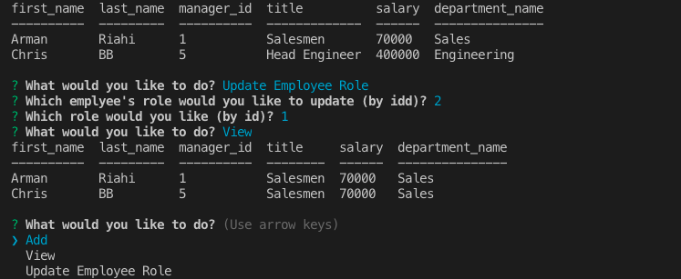

# Employee_Tracker

<br>

# Summary

This is a command line application that allows users to interact with a database (MySQL) for their employees. User's have the option to add and view departments, roles, and employees. In addition, a user may update a employee's role as well. The database is comrised of three tables; departments, roles, and employees. Through the use of various ID's, the three tables are joined to form a comprehensive table that displays all pertinent information regarding an employee.
<br>

# Sample Images

Example series of questions and answers:
<br>


<br>
<br>
<br>

Using update feature:
<br>


<br>

# Technologies

- HTML
- CSS
- VScode
- Git
- GitHub
- Javascript
- Node
- MySQL
- Inquirer

# Author

Arman Riahi

# Links

[LinkedIn](https://www.linkedin.com/in/arman-riahi/)
<br>

[GitHub](https://github.com/namrataffy)
<br>

# Code Snippet

Code showing how the table join is done:

```
function show() {
  var query = connection.query(
    " SELECT first_name,last_name, manager_id, title,salary, department.department_name   FROM employee  INNER JOIN role ON role.id = employee.role_id INNER JOIN department ON role.department_id = department.id",
    function(err, res) {
      console.table(res);
      inquirer.prompt(initialQ).then(choicesInit);
    }
  );
}

```
